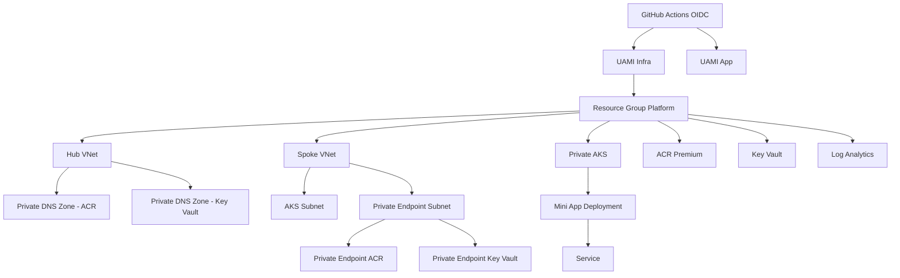

# Mini Landing Zone - Evaluacion Final Semillero

Implementacion de una mini Landing Zone en Azure con Terraform modular, GitHub Actions con OIDC y despliegue de aplicacion en AKS privado.

## Arquitectura



## Estructura del repositorio

- `.github/workflows/`: pipelines CI/CD
- `infra/`: Terraform root y modulos reutilizables
- `app/`: aplicacion, Dockerfile y manifiestos Kubernetes
- `docs/`: arquitectura, bitacora de Copilot y cumplimiento
- `scripts/`: bootstrap y utilidades operativas

## Requisitos

- Azure subscription con permisos para crear recursos
- Azure CLI (`az`) autenticado
- Terraform (>= 1.8)
- Docker
- Acceso a GitHub repository settings (branch protection y environments)

## Bootstrap del estado remoto

Ejecuta el script para crear RG/Storage/Container de tfstate y federation credentials:

```powershell
./scripts/bootstrap.ps1 `
  -SubscriptionId "<subscription-id>" `
  -TenantId "<tenant-id>" `
  -ServicePrincipalAppId "<app-id>" `
  -GitHubOrg "<org>" `
  -GitHubRepo "<repo>"
```

Si deseas que bootstrap tambien asegure permisos del operador requeridos por la entrega:

```powershell
./scripts/bootstrap.ps1 `
  -SubscriptionId "<subscription-id>" `
  -TenantId "<tenant-id>" `
  -ServicePrincipalAppId "<app-id>" `
  -GitHubOrg "<org>" `
  -GitHubRepo "<repo>" `
  -EnsureOperatorPermissions
```

Prueba en seco:

```powershell
./scripts/bootstrap.ps1 -WhatIf ...
```

## Flujo CI/CD

- Pull Request Infra: `.github/workflows/terraform-plan.yml`
  - `terraform fmt -check`
  - `terraform validate`
  - `terraform plan`
  - comentario automatico del plan en el PR

- Merge a main Infra: `.github/workflows/terraform-apply.yml`
  - `terraform apply` usando OIDC
  - environment `production`

- Merge a main App: `.github/workflows/app-build-deploy.yml`
  - build y push de imagen en ACR
  - despliegue en AKS por `kubectl apply`
  - aplica `SecretProviderClass` para consumir secretos de Key Vault via CSI

## Seguridad implementada

- Login a Azure via OIDC en GitHub Actions (`id-token: write`)
- Sin secretos de larga duracion en workflows
- ACR y Key Vault en modo privado con Private Endpoints
- AKS privado con RBAC
- consumo de secreto en workload via CSI driver de Key Vault
- Politicas Azure Policy para guardrails base

## Documentacion adicional

- Arquitectura: `docs/architecture.md`
- Bitacora Copilot: `docs/copilot-log.md`
- Reporte de cumplimiento: `docs/compliance-report.md`
- Prerrequisitos y alcance de bootstrap: `docs/prerequisites-bootstrap-scope.md`
- Trazabilidad de cambios: `docs/changes-2026-05-05.md`

## Cleanup (control de costos)

Para destruir toda la infraestructura administrada por Terraform:

```powershell
./scripts/cleanup.ps1 `
  -SubscriptionId "<subscription-id>" `
  -TenantId "<tenant-id>"
```

Para ademas eliminar backend de estado remoto (Storage + RG tfstate):

```powershell
./scripts/cleanup.ps1 `
  -SubscriptionId "<subscription-id>" `
  -TenantId "<tenant-id>" `
  -DeleteTfState
```

Nota: Ejecuta `bootstrap.ps1` y `cleanup.ps1` desde la raiz del repositorio para evitar errores de rutas relativas.
