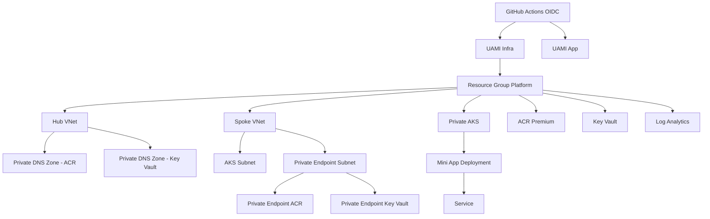

# Mini Landing Zone - Evaluacion Final Semillero

Implementacion de una mini Landing Zone en Azure con Terraform modular, GitHub Actions con OIDC y despliegue de aplicacion en AKS privado.

## Arquitectura



## Estructura del repositorio

- `.github/workflows/`: pipelines CI/CD
- `infra/`: Terraform root y modulos reutilizables
- `app/`: aplicacion, Dockerfile y manifiestos Kubernetes
- `docs/`: arquitectura, bitacora de Copilot y cumplimiento
- `scripts/`: bootstrap y utilidades operativas

## Requisitos

- Azure subscription con permisos para crear recursos
- Azure CLI (`az`) autenticado
- Terraform (>= 1.8)
- Docker
- Acceso a GitHub repository settings (branch protection y environments)

## Bootstrap del estado remoto

Ejecuta el script para crear RG/Storage/Container de tfstate y federation credentials:

```powershell
./scripts/bootstrap.ps1 `
  -SubscriptionId "<subscription-id>" `
  -TenantId "<tenant-id>" `
  -ServicePrincipalAppId "<app-id>" `
  -GitHubOrg "<org>" `
  -GitHubRepo "<repo>"
```

Si deseas que bootstrap tambien asegure permisos del operador requeridos por la entrega:

```powershell
./scripts/bootstrap.ps1 `
  -SubscriptionId "<subscription-id>" `
  -TenantId "<tenant-id>" `
  -ServicePrincipalAppId "<app-id>" `
  -GitHubOrg "<org>" `
  -GitHubRepo "<repo>" `
  -EnsureOperatorPermissions
```

Prueba en seco:

```powershell
./scripts/bootstrap.ps1 -WhatIf ...
```

## Flujo CI/CD

- Pull Request Infra: `.github/workflows/terraform-plan.yml`
  - `terraform fmt -check`
  - `terraform validate`
  - `terraform plan`
  - comentario automatico del plan en el PR

- Pull Request Infra (artefacto tfplan): `.github/workflows/infra-ci.yml`
  - `terraform fmt -check`
  - `terraform validate`
  - `terraform plan -out=tfplan`
  - publica `tfplan` como artifact

- Merge/push a rama principal (`main` o `master`) Infra: `.github/workflows/terraform-apply.yml`
  - `terraform apply` usando OIDC
  - environment `production`

- Merge/push a rama principal (`main` o `master`) App: `.github/workflows/app-build-deploy.yml`
  - build y push de imagen en ACR
  - despliegue en AKS por `kubectl apply`
  - aplica `SecretProviderClass` para consumir secretos de Key Vault via CSI
  - requiere runner `self-hosted`, `linux`, `aks-private`

## Seguridad implementada

- Login a Azure via OIDC en GitHub Actions (`id-token: write`)
- Sin secretos de larga duracion en workflows
- ACR y Key Vault en modo privado con Private Endpoints
- AKS privado con RBAC
- consumo de secreto en workload via CSI driver de Key Vault
- Politicas Azure Policy para guardrails base

## Documentacion adicional

- Arquitectura: `docs/architecture.md`
- Bitacora Copilot: `docs/copilot-log.md`
- Reporte de cumplimiento: `docs/compliance-report.md`
- Prerrequisitos y alcance de bootstrap: `docs/prerequisites-bootstrap-scope.md`
- Trazabilidad de cambios: `docs/changes-2026-05-05.md`

## Cleanup (control de costos)

Para destruir toda la infraestructura administrada por Terraform:

```powershell
./scripts/cleanup.ps1 `
  -SubscriptionId "<subscription-id>" `
  -TenantId "<tenant-id>"
```

Para ademas eliminar backend de estado remoto (Storage + RG tfstate):

```powershell
./scripts/cleanup.ps1 `
  -SubscriptionId "<subscription-id>" `
  -TenantId "<tenant-id>" `
  -DeleteTfState
```

Nota: Ejecuta `bootstrap.ps1` y `cleanup.ps1` desde la raiz del repositorio para evitar errores de rutas relativas.

## Estado de despliegue (2026-05-05)

Despliegue Terraform validado en suscripcion de laboratorio:

- `Apply complete! Resources: 49 added, 0 changed, 0 destroyed.`
- `resource_group_name=rg-contoso-dev-3cq7e`
- `aks_name=aks-contoso-dev-3cq7e`
- `acr_name=acrcontosodev3cq7e`
- `key_vault_name=kv-contoso-dev-3cq7e`
- `infra_client_id=99fc0e4f-879c-4d45-ab9a-f9de059b0831`
- `app_client_id=aacac888-60f4-4400-931a-d38bd144a244`

## Post-deploy (siguiente paso recomendado)

1. Configura variables en GitHub (Repository/Environment variables):
  - `AZURE_SUBSCRIPTION_ID=20877408-5d51-43c4-9e28-5b0cb03f03ea`
  - `AZURE_TENANT_ID=0b7e2c44-0f30-4d74-b898-0727b3f67fd4`
  - `AZURE_CLIENT_ID_INFRA=99fc0e4f-879c-4d45-ab9a-f9de059b0831`
  - `AZURE_CLIENT_ID_APP=aacac888-60f4-4400-931a-d38bd144a244`
  - `ACR_NAME=acrcontosodev3cq7e`
  - `AKS_RESOURCE_GROUP=rg-contoso-dev-3cq7e`
  - `AKS_NAME=aks-contoso-dev-3cq7e`
  - `KEY_VAULT_NAME=kv-contoso-dev-3cq7e`
  - `TFSTATE_RESOURCE_GROUP=rg-tfstate-mini-lz`
  - `TFSTATE_STORAGE_ACCOUNT=sttfstate20877408`
  - `TFSTATE_CONTAINER=tfstate`

2. Ejecuta pipeline de infraestructura (`terraform-plan` o `infra-ci` en PR, o `terraform-apply` en la rama principal).

3. Ejecuta pipeline de aplicacion para build/push a ACR y despliegue en AKS.

4. Verifica estado operativo:

```powershell
az aks get-credentials --resource-group rg-contoso-dev-3cq7e --name aks-contoso-dev-3cq7e --overwrite-existing
kubectl get nodes
kubectl get pods -A
```
