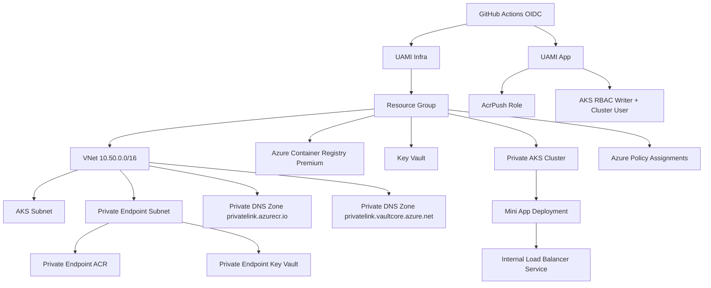

# Mini Landing Zone Architecture (Single Subscription)

## CAF Mapping (Scoped)

- Governance: Azure Policy assigned at resource group scope.
- Security: Private Endpoints, public network disabled for ACR and Key Vault, RBAC-only access.
- Identity: Managed identities with GitHub OIDC federation, no client secrets.
- Platform: Hub-and-spoke style reduced to one VNet due to single-subscription constraint.
- DevOps: CI/CD split for infrastructure and app deployment.

# Equivalencias de Tenant a Suscripción

En este documento se describen las equivalencias implementadas en el código para sustituir capacidades a nivel de tenant por configuraciones a nivel de suscripción, siguiendo las mejores prácticas del Cloud Adoption Framework (CAF) y las restricciones del laboratorio.

## Equivalencias Implementadas

1. **Management Groups y Jerarquía Corporativa**
   - Sustituido por: Estructura de Resource Groups por tier:
     - `rg-platform`
     - `rg-network-hub`
     - `rg-spoke-app`
     - `rg-shared`
   - Documentación adicional: Se incluye la jerarquía teórica de Management Groups en la documentación.

2. **Azure Policy a Nivel de Tenant o Management Group**
   - Sustituido por: Asignaciones de Azure Policy a nivel de suscripción y Resource Group.
   - Policies implementadas:
     - Tags obligatorios.
     - Ubicaciones permitidas.
     - Denegación de acceso público en Storage Accounts.

3. **Hub Central Compartido, ExpressRoute o VPN Site-to-Site**
   - Sustituido por: Topología Hub-Spoke dentro de la suscripción.
   - Implementación:
     - VNet Peering local.
     - NSGs configurados por subred.
     - Private Endpoints para servicios críticos.

4. **Administración de Entra ID**
   - Sustituido por: Managed Identities (System y User-Assigned) y RBAC sobre recursos.
   - Notas:
     - Las App Registrations y Service Principals son pre-creadas por el instructor y entregadas como variables.

5. **Defender for Cloud a Nivel Tenant**
   - Sustituido por: Habilitación de planes de Defender a nivel de suscripción.
   - Planes habilitados:
     - Servers.
     - Containers.
     - Key Vault.
   - Revisión de recomendaciones activada.

6. **Log Analytics Workspace Centralizado**
   - Sustituido por: Workspace propio en `rg-platform`.
   - Configuración:
     - Diagnostic Settings configurados desde cada recurso evaluado.

## Confirmación de Implementación

El código en este repositorio implementa las equivalencias descritas de la siguiente manera:

- **Terraform Modules**: Los módulos de Terraform están diseñados para reflejar estas equivalencias, con configuraciones específicas para Resource Groups, Azure Policy, y topología de red.
- **Scripts de Bootstrap**: Los scripts de inicialización configuran las identidades y roles necesarios para cumplir con estas equivalencias.
- **Workflows de GitHub Actions**: Los pipelines de CI/CD aseguran que las configuraciones sean consistentes y reproducibles.

Para más detalles, consulta los archivos relevantes en el repositorio.
