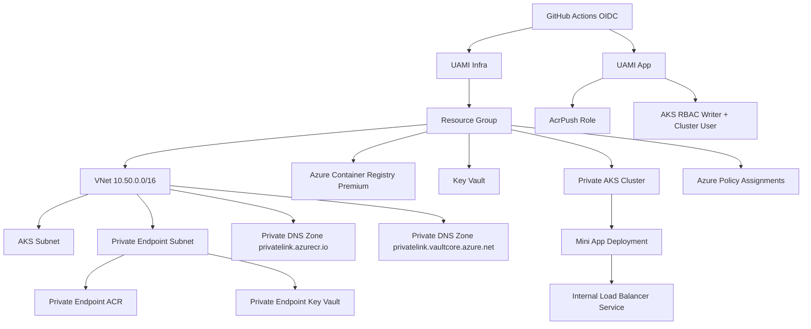

# Mini Landing Zone Architecture (Single Subscription)

## CAF Mapping (Scoped)

- Governance: Azure Policy assigned at resource group scope.
- Security: Private Endpoints, public network disabled for ACR and Key Vault, RBAC-only access.
- Identity: Managed identities with GitHub OIDC federation, no client secrets.
- Platform: Hub-and-spoke style reduced to one VNet due to single-subscription constraint.
- DevOps: CI/CD split for infrastructure and app deployment.
